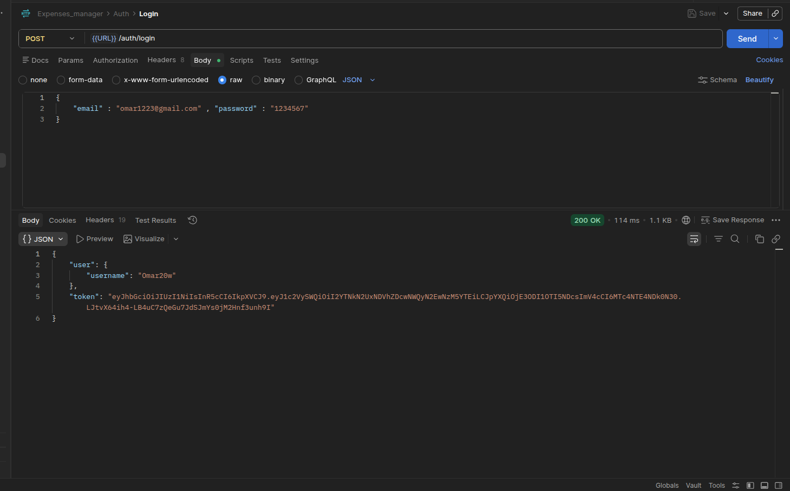
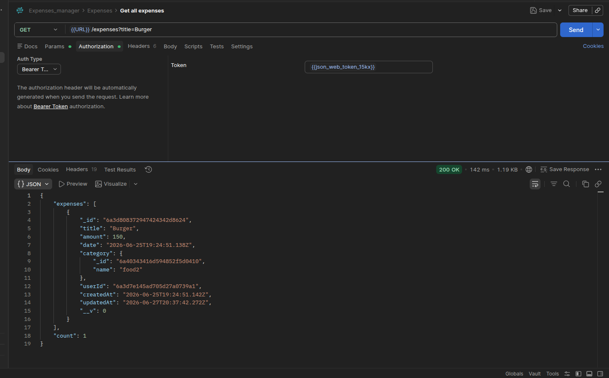
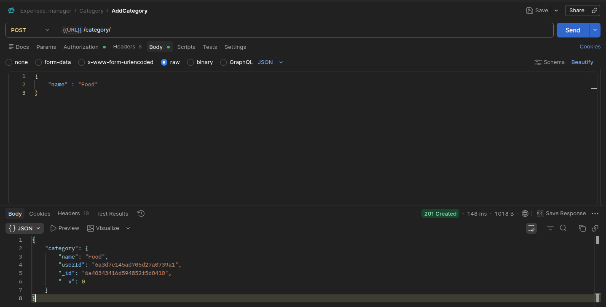
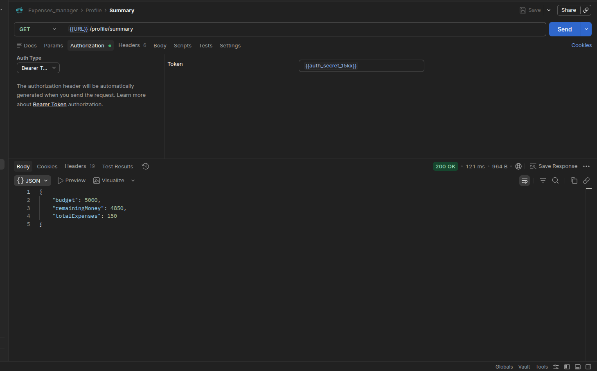

# Expenses Manager

A focused, production-minded Node.js + Express API for personal expense tracking. It provides secure user registration and login, budget management, CRUD for expenses and categories, and a profile summary endpoint that calculates total spending and remaining budget. The project uses MongoDB (Mongoose) for persistence and JSON Web Tokens (JWT) for authentication, and it now includes category safety checks, expense statistics, and budget status responses after expense changes.

## Live API

The API is deployed and publicly accessible on Railway.

**Base URL**

```text
https://expenses-managerapi-production.up.railway.app
```

You can use this URL directly with Postman, Bruno, or any HTTP client.

## Postman Collection

A ready-to-use Postman collection is included in this repository.

The collection is organized into:

- Authentication
- Expenses
- Categories
- Profile

All request bodies contain placeholder fields so you only need to fill in your own values before sending the request.

Example:

```json
{
  "title": "",
  "amount": "",
  "category": ""
}
```

All authenticated requests already contain a Bearer Token field.
Simply paste the JWT received from the Login endpoint.

## Postman Environments

Two Postman environments are included:

| Environment | Purpose                       |
| ----------- | ----------------------------- |
| Localhost   | Test the API locally          |
| Production  | Test the deployed Railway API |

The collection uses environment variables instead of hardcoded URLs.

Example:

```text
{{URL}}/expenses
```

Switching between local development and the deployed API only requires changing the active Postman environment.

## Testing the API

Import the provided Postman collection together with one of the included environments.

### Local Development

Select the **localhost** environment.

```
{{URL}}
```

will automatically point to

```
http://localhost:5000
```

### Production

Select the **Production** environment.

```
{{URL}}
```

will automatically point to

```
https://expenses-managerapi-production.up.railway.app
```

No request URLs need to be modified manually.

## Project Highlights

- Secure authentication with JWT and bcrypt
- Expense CRUD with advanced list features: filtering, sorting, field selection, and pagination
- Category management with per-user uniqueness and safe deletion rules
- Profile summary endpoint that derives remaining budget from stored budget and expenses
- Centralized error handling and common security middleware (Helmet + XSS protection)

## Tech Stack

- Node.js, Express
- MongoDB with Mongoose
- JWT for auth, bcrypt for password hashing
- Helmet, xss-clean, cors for security and robustness

## Project Structure

```text
Expenses-Manager/
├── app.js                 # Express app & route mounting
├── Controller/            # Route handlers
├── DB/                    # DB connection helper
├── Error/                 # Custom error classes
├── MiddleWare/            # auth + error handling middleware
├── Models/                # Mongoose models
├── assets/
│   └── screenshots/       # README screenshots
├── Routes/                # Express routers
├── README.md
└── package.json

Postman/
├── Expenses_manager.postman_collection.json
├── localhost.postman_environment.json
└── ProductionLink.postman_environment.json
```

## Dependencies

Key runtime dependencies (already in `package.json`):

- express
- mongoose
- jsonwebtoken
- bcrypt
- helmet
- xss-clean
- cors
- express-async-errors
- http-status-codes
- dotenv

Dev dependencies:

- nodemon

## Setup & Run

1. Install dependencies:

```bash
npm install
```

2. Create a `.env` file in the project root with:

```env
PORT=5000
MONGO_URI=your_mongodb_connection_string
JWT_SECRET=your_jwt_secret
JWT_LIFETIME=30d
```

3. Start the server (development):

```bash
npm start
```

The app uses `nodemon` for development reloads.

## API Overview

All protected routes require an `Authorization` header with a Bearer token:

```
Authorization: Bearer <token>
```

Protected routes are enforced by the auth middleware, so every category, expense, and profile request must belong to the logged-in user.

### Authentication

- `POST /auth/register` — Register a new user. Provide `username`, `email`, `password`, and optional `budget`.
- `POST /auth/login` — Log in and receive a JWT token. Provide `email` and `password`.

### Expenses

Protected with JWT.

- `GET /expenses` — List expenses for the authenticated user. Supports filtering, sorting, field selection, and pagination.
- `POST /expenses` — Create a new expense. Payload: `title`, `amount`, `date` (optional), `category` (ObjectId). The response also returns `budgetStatus`.
- `PATCH /expenses/:id` — Update an expense (owned by user). The response also returns `budgetStatus`.
- `DELETE /expenses/:id` — Delete an expense (owned by user). The response also returns `budgetStatus`.
- `GET /expenses/statistics` — Returns per-category spending statistics plus the current budget status.

Query parameters for `GET /expenses`:

- `title` — case-insensitive partial match on title
- `amount` — exact amount match
- `date` — exact date match
- `category` — filter by category id
- `sort` — comma-separated fields to sort by (prefix `-` for descending), e.g. `sort=createdAt,-amount`
- `fields` — comma-separated fields to include, e.g. `fields=title,amount,date`
- `page` — page number (default `1`)
- `limit` — items per page (default `10`)

Example request:

```http
GET /expenses?category=60a7b6f8...&sort=createdAt,-amount&fields=title,amount,category&page=1&limit=5
Authorization: Bearer <token>
```

Example create payload:

```json
{
  "title": "Lunch",
  "amount": 12.5,
  "date": "2026-06-27",
  "category": "60a7b6f8..."
}
```

### Categories

Protected with JWT.

- `GET /category` — List categories for the authenticated user.
- `POST /category` — Create a category. Payload: `{ "name": "Food" }`.
- `PATCH /category/:id` — Rename a category.
- `DELETE /category/:id` — Delete a category. Deletion is prevented if any expenses reference the category (safe-delete rule).

Category names are checked per user, so the same user cannot create the same category twice.

Example delete error response when a category has associated expenses:

```json
{ "message": "Cannot delete category with associated expenses" }
```

### Profile

Protected with JWT.

- `GET /profile` — Get user profile (username, email, budget, etc.).
- `PATCH /profile/update` — Update profile fields such as `username`, `email`, `budget`, `password`.
- `GET /profile/summary` — Returns `budget`, `totalExpenses`, and `remainingMoney` (derived as `budget - totalExpenses`).

## Test Coverage

The repository includes Jest and Supertest integration tests for:

- Authentication
- Profile routes
- Category routes
- Expense routes

The tests use a live MongoDB connection in the same style as the application, so they validate the real request flow instead of only isolated functions.

Example `GET /profile/summary` response:

```json
{
  "budget": 1000,
  "remainingMoney": 650,
  "totalExpenses": 350
}
```

## API Testing

This project is easy to test with Postman.

- A Postman collection can be used to test the full API flow.
- Recommended endpoints to include in the collection: auth, expenses, categories, and profile summary.
- If you add screenshots, keep them focused on real responses rather than the full Postman UI.

Best screenshot targets if you want to showcase the API visually:

- `POST /auth/login`
- `GET /expenses?category=...&sort=createdAt,-amount&fields=title,amount,category&page=1&limit=5`
- `POST /category`
- `GET /profile/summary`

Suggested order for screenshots:

1. Login response with JWT token
2. Expense list with filters and pagination applied
3. Category create/update/delete flow
4. Profile summary response showing budget, totalExpenses, and remainingMoney

## Screenshots

Add the following images to show the API flow clearly:

### Authentication



### Expenses



### Categories



### Profile



If you want to show the category delete rule as well, you can add that screenshot later, but the four images above are the cleanest set for the README.

## Data Models (summary)

### User

- `username` (String, required, unique)
- `email` (String, required, unique)
- `password` (String, required, hashed)
- `budget` (Number, default 0)

### Expense

- `title` (String, required)
- `amount` (Number, required)
- `date` (Date)
- `category` (ObjectId -> Category, required)
- `userId` (ObjectId -> User, required)

### Category

- `name` (String, required)
- `userId` (ObjectId -> User, required)
- Unique index per-user on `name`

## Error Handling

The app uses custom error classes in `Error/` and a centralized middleware `MiddleWare/error-handler.js` that maps Mongoose validation errors, duplicate-key errors, and CastError to readable messages and proper HTTP status codes.

## Security

- Passwords hashed with `bcrypt` before save/update.
- Helmet and `xss-clean` middleware applied for basic security hardening.
- Routes that mutate or read user data are protected by an `auth` middleware that validates JWT tokens.

## DB Connection

`DB/connect.js` reads `MONGO_URI` from `.env`. Ensure your URI is valid and MongoDB is reachable.

## Troubleshooting

- Authentication errors: ensure `JWT_SECRET` in `.env` matches the secret used to generate tokens.
- DB errors: check `MONGO_URI` and network connectivity.
- If you change schemas, restart the server (nodemon will auto-reload during development).

## Contributing & Next Steps

- Add automated tests (unit & integration)
- Add monthly aggregation endpoints (spending by month/category)
- Create a small React/Vue frontend that consumes this API

---

Built as a clean, focused API example for personal projects and portfolio demonstration.
